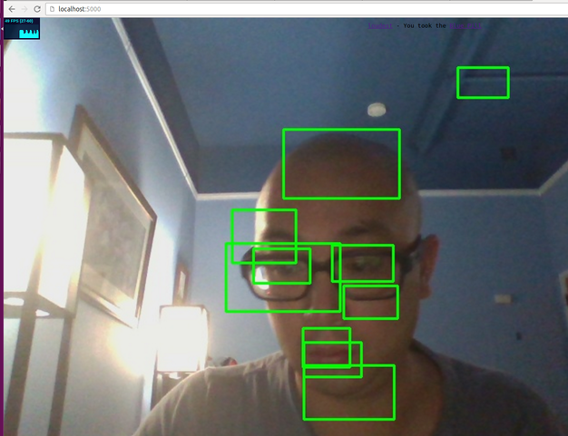

## Python videostreams for facial recognization & biometrics

## Challenge and Approach

Our approach for satisfying this Machine Learning challenge was to:

1. Analyize video streams with facial object detection and apply biometric markers to data.
2. Utilize IoT sensors (such as tempature, humidity) to improve the data collection process.
3. Develop an microservice that outputs JSON data so Machine Learning datasets can be collected.

## Team Members

Our team is comprised of:

- [@loudest](https://github.com/loudest) - README.md writer, took the "blue pill" in the matrix and spent 3 days at [VR Hackathon - Seattle] (http://vrhackathon.com/seattle.html) coding this

## Technologies, APIs, and Datasets Utilized

We made use of:
- [Flask](http://flask.pocoo.org/) to render local host and video streams
- [OpenCV](http://opencv.org/) for video analysis and facial detection
- [openbr](http://openbiometrics.org/) biometrics markers and using machine learning to improve accuracy
- [Arduino Uno](https://www.arduino.cc/en/Main/ArduinoBoardUno/) to obtain temperature and humidity data.

## How to run our app:

1. Go into the server/ directory
2. Run it via: python main.py

## TO-DO

1. [Blocking I/O] In camera.py, the function parse_serial_connection() utilizes a COM3 serial connection on an Arduino board.  The I/O is polling very 60 seconds.
2. [Threading] Update sensor data as a sperate thread with a dynamic endpoint to a Flask route.  

Our code is licensed under the [MIT License](LICENSE.md). Pull requests will be accepted to this repo, pending review and approval.
